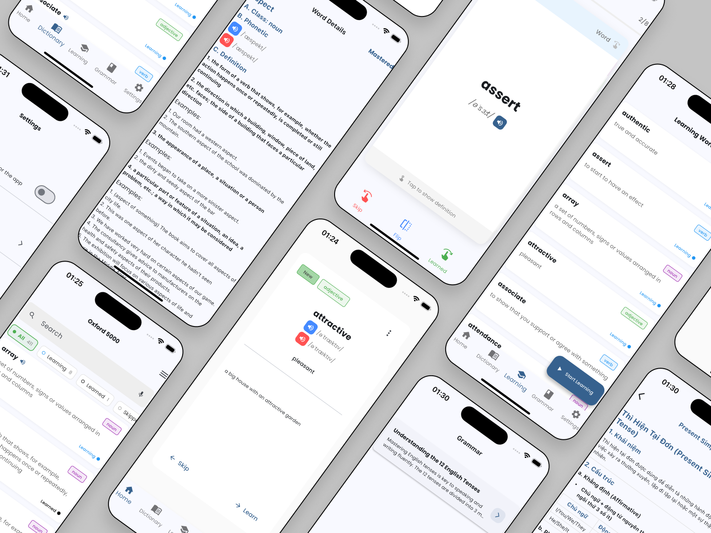

# Brainy - Language Learning App

A modern language learning application built with Flutter that focuses on vocabulary acquisition, grammar learning, and pronunciation practice.

## App Showcase

## Features

### Vocabulary Learning

- **Swipe Cards**: Learn new words through an intuitive card swiping interface
- **Word Status**: Track words as "learning", "learned", or "skipped"
- **Audio Pronunciation**: Listen to correct pronunciations
- **Part of Speech**: Visual indicators for different parts of speech (nouns, verbs, adjectives, etc.)

### Dictionary

- **Search**: Find words quickly
- **Filtering**: Filter by learning status
- **Details View**: Comprehensive word information including definitions and examples

### Grammar

- **Categorized Content**: Browse grammar topics by category
- **Progress Tracking**: Monitor your progress through grammar lessons
- **Rich Content**: Beautifully formatted lessons with tables, lists, and examples
- **Markdown Rendering**: High-quality display of grammar content

### Settings

- **Theme Settings**: Customize app appearance
- **Notification Preferences**: Control learning reminders
- **Learning Goals**: Set daily study targets

## Architecture

The app is built using the MVVM (Model-View-ViewModel) architecture with:

- **Repository Pattern**: Clean separation of data sources
- **Dependency Injection**: Using GetIt for service location
- **Feature-First Organization**: Code organized by feature rather than layer

## Technologies Used

- **Flutter**: UI framework
- **Dart**: Programming language
- **Provider**: State management
- **just_audio**: Audio playback
- **flutter_markdown**: Markdown rendering
- **flutter_card_swiper**: Card swiping interface
- **shared_preferences**: Local storage

## Setup

1. Clone the repository
2. Run `flutter pub get` to install dependencies
3. Make sure you have the Flutter SDK installed
4. Run `flutter run` to start the app

## API Integration

The app connects to a RESTful backend API with endpoints for:

- Authentication
- Dictionary
- Learning progress
- Grammar categories and lessons

## Contributing

Contributions are welcome! Please feel free to submit a Pull Request.

## License

This project is licensed under the MIT License - see the LICENSE file for details.
